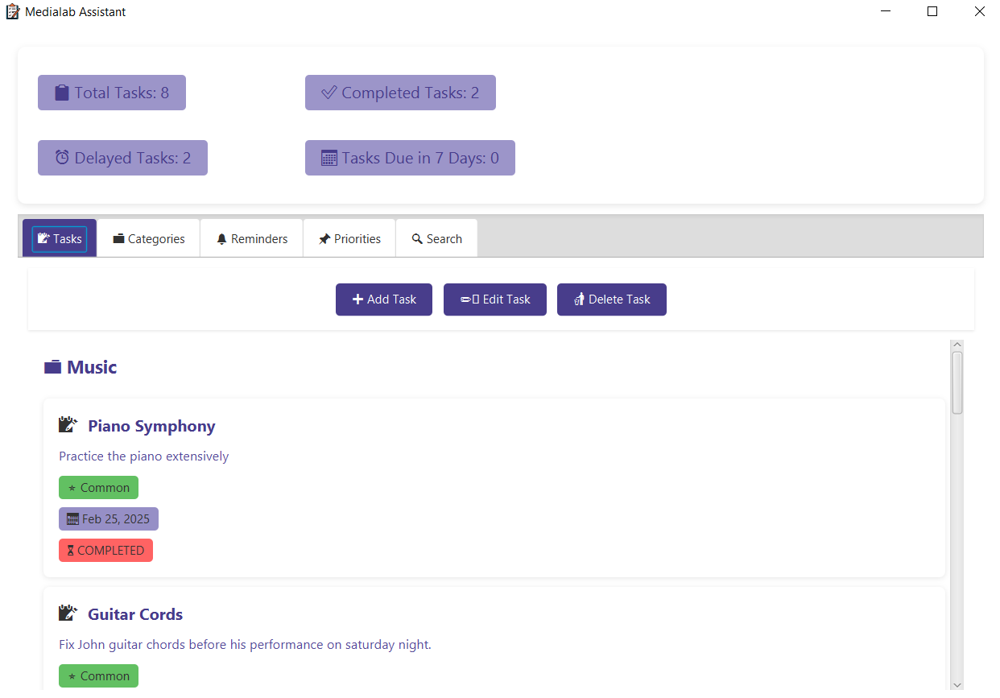
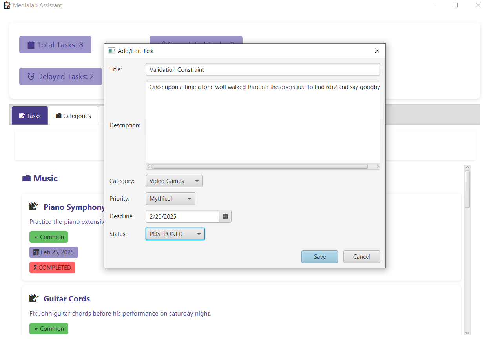
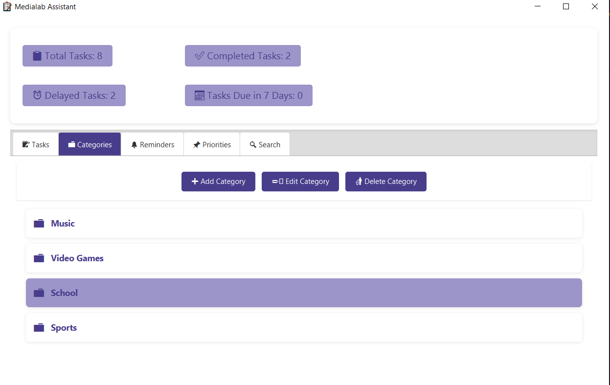
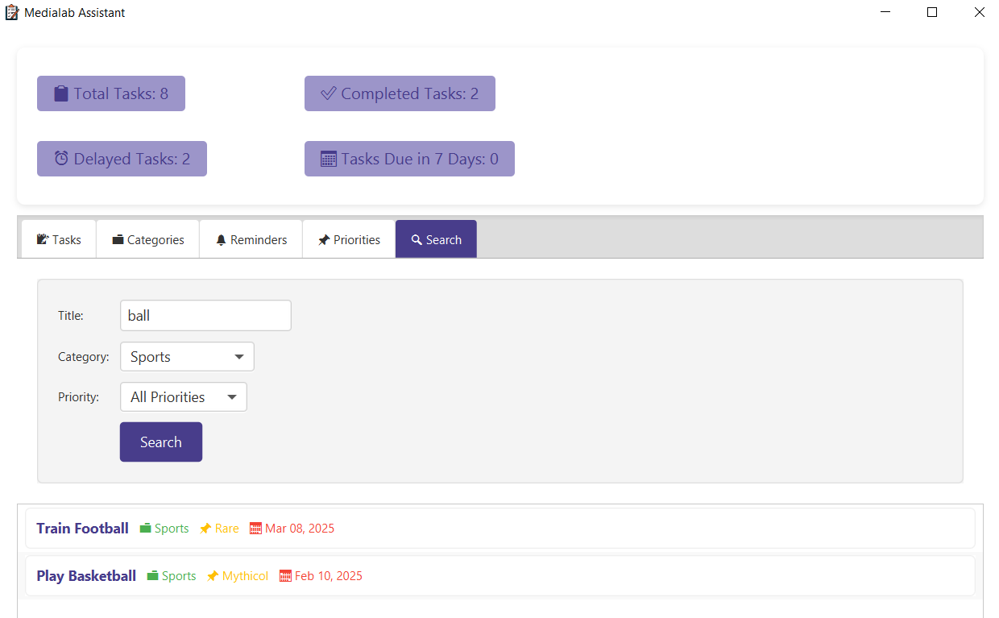
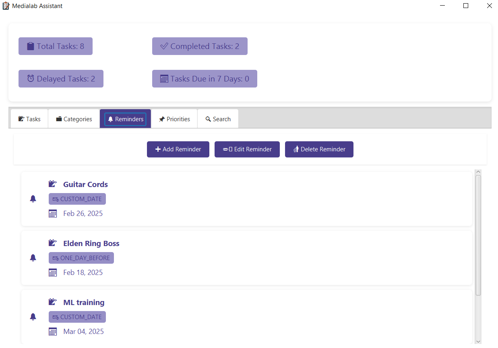

# 📝 Task Management System

Welcome to the **Task Management System**! This is a Java-based application built with **JavaFX** for the graphical user interface (GUI) and **Maven** for dependency management. It helps you manage tasks through categories, priorities, and reminders in an organized and efficient way.

---

## 🛠️ Technologies Used

- **Java**: Core programming language.
- **JavaFX**: For building the graphical user interface (GUI).
- **Maven**: For dependency management and building the project.
- **JSON**: For data storage and retrieval.

---

## 🚀 How to Run the Project

Follow these steps to set up and run the Task Management System on your local machine.

### Prerequisites

- **Java Development Kit (JDK)**: Ensure you have JDK 11 or later installed.
- **Maven**: Ensure Maven is installed and configured on your system.

### Step 1: Clone the Repository

Clone the project repository to your local machine:

```bash
git clone [repo_url]
cd Task_Management_System
```

### Step 2: Build the Project

Use Maven to build the project:

```bash
mvn clean install
```

This will compile the project and download all required dependencies.

### Step 3: Run the Application

Run the application using the following command:

```bash
mvn javafx:run
```
> Alternatively, you can run the Main class directly from your IDE (e.g., IntelliJ IDEA, Eclipse).

## Screenshots 📸

<div style="display: grid; grid-template-columns: repeat(2, 1fr); gap: 40px; max-width: 200px; margin: 0 auto; padding: 20px;">
  
  
  
  
  
  
  
</div>


## 🌟 Features

- **Task Management**:
  - Create, edit, and delete tasks.
  - Set task details like title, description, category, priority, deadline, and status.
  - Automatic status updates (e.g., tasks past their deadline are marked as "Delayed"). ⏰

- **Category Management**:
  - Create, edit, and delete categories.
  - Tasks are grouped by category for easy organization. 🗂️

- **Priority Management**:
  - Define and manage priority levels (e.g., High, Medium, Low).
  - Default priority level cannot be edited or deleted. 🔝

- **Reminder Management**:
  - Set reminders for tasks (e.g., 1 day, 1 week, or 1 month before the deadline).
  - Reminders are automatically removed for completed tasks. 🔔

- **Search Functionality**:
  - Search for tasks by title, category, or priority. 🔍

- **Data Persistence**:
  - All data is saved to JSON files (`tasks.json`, `categories.json`, `priorities.json`, `reminders.json`) in the `medialab` directory. 💾
